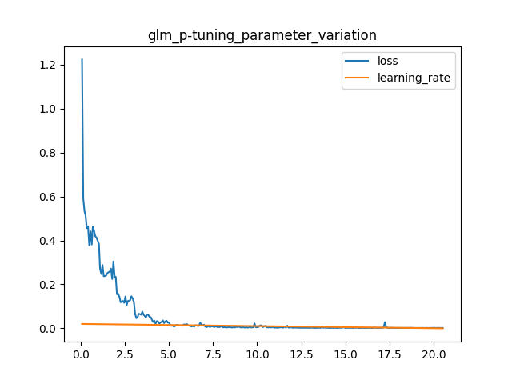
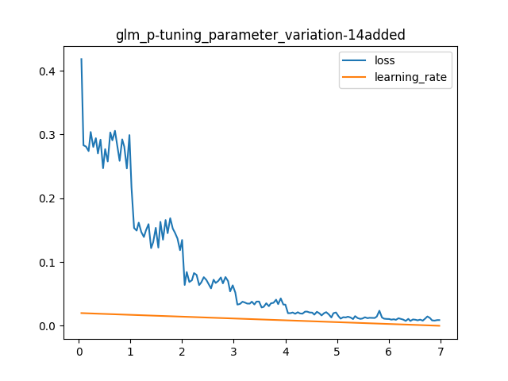

# Environment
- AUTODL mirror: 
    ```
    PyTorch  1.11.0
    Python  3.8(ubuntu20.04)
    Cuda  11.3
    ```
- GPU: `RTX 3090 (24GB) * 1`
- CPU: `12 vCPU Intel(R) Xeon(R) Platinum 8255C CPU @ 2.50GHz`
- MEMORY: `43GB`

# DataSets
- [sighan dataset](https://github.com/onebula/sighan_raw/tree/master/pair_data/simplified) 
    - **Train set** sighan train set
    - **validation set** sighan test set

- **test set**: data.txt of nlpcc 2023 task8 
# Preprocess
- run script: `python3 preprocess.sh`
- If you want to change dataset, you can change set paths in `preprocess.sh`


# **CHATGLM-6b** Tuning 
## sighan15 only
- `prompt selection`: 
    ```python
    "请纠正此句的错别字:"
    ```
- `p-tuning v2` training config:
    ```
    pre_seq_len=128
    learning_rate=2e-2
    quantization_bit=4
    per_device_train_batch_size=16
    gradient_accumulation_steps=1
    ```

- `train metrics`: 
    ```
    "epoch": 20.52,
    "train_loss": 0.05146254489819209,
    "train_runtime": 11735.9908,
    "train_samples": 2339,
    "train_samples_per_second": 4.09,
    "train_steps_per_second": 0.256
    ```
- `training parameters variation`
    

- `evaluate`
    ```
    precision：45.4(54/119)
    recall：10.82(54/499)
    F1：18.27
    ```
    
- `analyze`
    * Since the test data is external sighan data set, the poor effect is due to the lack of generalization ability of the model.
    * So the attempt added 14 years of training data to further fine-tune.
    * The reason of reducing training step is that: (1) in the previous experiment, the loss had already converged at about 1500steps. (2) With the consideration of not to overtrain.

## sighan14 added
- `prompt selection`: 
    ```python
    "请纠正此句的错别字:"
    ```
- `p-tuning v2` training config:
    ```
    pre_seq_len=128
    learning_rate=2e-2
    quantization_bit=4
    per_device_train_batch_size=16
    gradient_accumulation_steps=1
    ```

- `train metrics`: 
    ```
    "epoch": 6.98,
    "train_loss": 0.08316797427336375,
    "train_runtime": 14130.1324,
    "train_samples": 3437,
    "train_samples_per_second": 1.698,
    "train_steps_per_second": 0.106
    ```
- `predict metrics`: 
    ```
    predict_bleu-4             =    95.3306
    predict_rouge-1            =    96.6221
    predict_rouge-2            =    93.7217
    predict_rouge-l            =    96.6279
    predict_runtime            = 0:26:23.09
    predict_samples            =       1000
    predict_samples_per_second =      0.632
    predict_steps_per_second   =      0.632
    ```
- `training parameters variation`
    

- `evaluation`
    ```bash
    precision：58.82(70/119)
    recall：14.03(70/499)
    F1：22.66
    ```

- `analyze`
    - The trend of loss decline curve was similar to the previous experiment.
    - You can see that the loss on the validation set at the beginning of the training is not as high as in the first experiment.
    - There is a slight improvement.

# File Dir Tree
- Here is the dir tree including whole source needed and result files outputed.
-` workflow.sh` is script of flow from training to evaluating.

```bash
.
├── competitors
│   └── glm
│       ├── arguments.py
│       ├── deepspeed.json
│       ├── ds_train_finetune.sh
│       ├── evaluate_finetune.sh
│       ├── evaluate.sh
│       ├── main.py
│       ├── output
│       │   ├── csc-chatglm-6b-pt-128-2e-2
│       │   │   ├── all_results.json
│       │   │   ├── checkpoint-1000
│       │   │   │   ├── config.json
│       │   │   │   ├── configuration_chatglm.py
│       │   │   │   ├── generation_config.json
│       │   │   │   ├── ice_text.model
│       │   │   │   ├── modeling_chatglm.py
│       │   │   │   ├── optimizer.pt
│       │   │   │   ├── pytorch_model.bin
│       │   │   │   ├── quantization.py
│       │   │   │   ├── rng_state.pth
│       │   │   │   ├── scheduler.pt
│       │   │   │   ├── special_tokens_map.json
│       │   │   │   ├── tokenization_chatglm.py
│       │   │   │   ├── tokenizer_config.json
│       │   │   │   ├── trainer_state.json
│       │   │   │   └── training_args.bin
│       │   │   ├── checkpoint-1500
│       │   │   │   ├── config.json
│       │   │   │   ├── configuration_chatglm.py
│       │   │   │   ├── generation_config.json
│       │   │   │   ├── ice_text.model
│       │   │   │   ├── modeling_chatglm.py
│       │   │   │   ├── optimizer.pt
│       │   │   │   ├── pytorch_model.bin
│       │   │   │   ├── quantization.py
│       │   │   │   ├── rng_state.pth
│       │   │   │   ├── scheduler.pt
│       │   │   │   ├── special_tokens_map.json
│       │   │   │   ├── tokenization_chatglm.py
│       │   │   │   ├── tokenizer_config.json
│       │   │   │   ├── trainer_state.json
│       │   │   │   └── training_args.bin
│       │   │   ├── checkpoint-500
│       │   │   │   ├── config.json
│       │   │   │   ├── configuration_chatglm.py
│       │   │   │   ├── generation_config.json
│       │   │   │   ├── ice_text.model
│       │   │   │   ├── modeling_chatglm.py
│       │   │   │   ├── optimizer.pt
│       │   │   │   ├── pytorch_model.bin
│       │   │   │   ├── quantization.py
│       │   │   │   ├── rng_state.pth
│       │   │   │   ├── scheduler.pt
│       │   │   │   ├── special_tokens_map.json
│       │   │   │   ├── tokenization_chatglm.py
│       │   │   │   ├── tokenizer_config.json
│       │   │   │   ├── trainer_state.json
│       │   │   │   └── training_args.bin
│       │   │   ├── generated_predictions.txt
│       │   │   ├── predict_results.json
│       │   │   ├── runs
│       │   │   │   ├── Dec05_23-21-35_autodl-container-844a119352-e8764eea
│       │   │   │   │   ├── 1701789884.4821625
│       │   │   │   │   │   └── events.out.tfevents.1701789884.autodl-container-844a119352-e8764eea.2980.1
│       │   │   │   │   └── events.out.tfevents.1701789884.autodl-container-844a119352-e8764eea.2980.0
│       │   │   │   ├── Dec06_21-38-29_autodl-container-844a119352-e8764eea
│       │   │   │   │   ├── 1701870122.8706849
│       │   │   │   │   │   └── events.out.tfevents.1701870122.autodl-container-844a119352-e8764eea.2115.1
│       │   │   │   │   └── events.out.tfevents.1701870122.autodl-container-844a119352-e8764eea.2115.0
│       │   │   │   ├── Dec06_21-47-39_autodl-container-844a119352-e8764eea
│       │   │   │   │   ├── 1701870668.3436375
│       │   │   │   │   │   └── events.out.tfevents.1701870668.autodl-container-844a119352-e8764eea.3826.1
│       │   │   │   │   └── events.out.tfevents.1701870668.autodl-container-844a119352-e8764eea.3826.0
│       │   │   │   ├── Dec06_22-12-48_autodl-container-844a119352-e8764eea
│       │   │   │   │   ├── 1701872162.9506614
│       │   │   │   │   │   └── events.out.tfevents.1701872162.autodl-container-844a119352-e8764eea.5930.1
│       │   │   │   │   └── events.out.tfevents.1701872162.autodl-container-844a119352-e8764eea.5930.0
│       │   │   │   ├── Dec07_11-56-54_autodl-container-844a119352-e8764eea
│       │   │   │   │   ├── 1701921615.6658196
│       │   │   │   │   │   └── events.out.tfevents.1701921615.autodl-container-844a119352-e8764eea.8207.1
│       │   │   │   │   └── events.out.tfevents.1701921615.autodl-container-844a119352-e8764eea.8207.0
│       │   │   │   ├── Dec07_13-03-02_autodl-container-844a119352-e8764eea
│       │   │   │   │   ├── 1701925565.1714225
│       │   │   │   │   │   └── events.out.tfevents.1701925565.autodl-container-844a119352-e8764eea.17205.1
│       │   │   │   │   └── events.out.tfevents.1701925565.autodl-container-844a119352-e8764eea.17205.0
│       │   │   │   ├── Dec07_13-19-31_autodl-container-844a119352-e8764eea
│       │   │   │   │   ├── 1701926552.725502
│       │   │   │   │   │   └── events.out.tfevents.1701926552.autodl-container-844a119352-e8764eea.19564.1
│       │   │   │   │   └── events.out.tfevents.1701926552.autodl-container-844a119352-e8764eea.19564.0
│       │   │   │   ├── Dec07_17-00-03_autodl-container-844a119352-e8764eea
│       │   │   │   │   ├── 1701939792.6486707
│       │   │   │   │   │   └── events.out.tfevents.1701939792.autodl-container-844a119352-e8764eea.3335.1
│       │   │   │   │   └── events.out.tfevents.1701939792.autodl-container-844a119352-e8764eea.3335.0
│       │   │   │   └── Dec07_21-39-13_autodl-container-844a119352-e8764eea
│       │   │   │       ├── 1701956536.0829728
│       │   │   │       │   └── events.out.tfevents.1701956536.autodl-container-844a119352-e8764eea.68087.1
│       │   │   │       └── events.out.tfevents.1701956536.autodl-container-844a119352-e8764eea.68087.0
│       │   │   ├── trainer_state.json
│       │   │   └── train_results.json
│       │   ├── csc-glm-sighan-1514
│       │   │   ├── config.json
│       │   │   ├── configuration_chatglm.py
│       │   │   ├── generation_config.json
│       │   │   ├── ice_text.model
│       │   │   ├── modeling_chatglm.py
│       │   │   ├── optimizer.pt
│       │   │   ├── pytorch_model.bin
│       │   │   ├── quantization.py
│       │   │   ├── rng_state.pth
│       │   │   ├── scheduler.pt
│       │   │   ├── special_tokens_map.json
│       │   │   ├── tokenization_chatglm.py
│       │   │   ├── tokenizer_config.json
│       │   │   ├── trainer_state.json
│       │   │   └── training_args.bin
│       │   └── csc-glm-sighan-15-only
│       │       ├── config.json
│       │       ├── configuration_chatglm.py
│       │       ├── generation_config.json
│       │       ├── ice_text.model
│       │       ├── modeling_chatglm.py
│       │       ├── optimizer.pt
│       │       ├── pytorch_model.bin
│       │       ├── quantization.py
│       │       ├── rng_state.pth
│       │       ├── scheduler.pt
│       │       ├── special_tokens_map.json
│       │       ├── tokenization_chatglm.py
│       │       ├── tokenizer_config.json
│       │       ├── trainer_state.json
│       │       └── training_args.bin
│       ├── __pycache__
│       │   ├── arguments.cpython-38.pyc
│       │   ├── trainer.cpython-38.pyc
│       │   └── trainer_seq2seq.cpython-38.pyc
│       ├── train_chat.sh
│       ├── trainer.py
│       ├── trainer_seq2seq.py
│       ├── train.sh
│       ├── web_demo.py
│       └── web_demo.sh
├── csc_evaluate.sh
├── data
│   ├── nlpcc_data.txt
│   ├── simplified
│   │   ├── test13_correct.txt
│   │   ├── test13_error.txt
│   │   ├── test14_correct.txt
│   │   ├── test14_error.txt
│   │   ├── test15_correct.txt
│   │   ├── test15_error.txt
│   │   ├── train13_correct.txt
│   │   ├── train13_error.txt
│   │   ├── train14_correct.txt
│   │   ├── train14_error.txt
│   │   ├── train15_correct.txt
│   │   └── train15_error.txt
│   ├── test.json
│   ├── train.json
│   └── validation.json
├── pic
│   ├── glm_p-tuning_parameter_variation-14added.png
│   └── glm_p-tuning_parameter_variation-15only.png
├── preprocess.sh
├── README.md
├── requirements.txt
├── utils
│   ├── evaluate.py
│   ├── nlpcc_data_preprocess.py
│   ├── preprocess.py
│   └── visualizer.py
├── visualize.sh
└── workflow.sh

33 directories, 141 files
```
